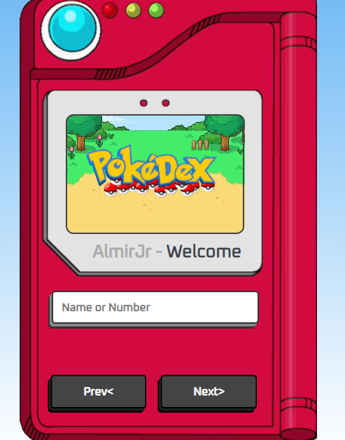

# Pokédex - AlmirJrDev👨‍💻

Pokédex feita com JavaScript, usando API do 
 [PokéAPI](https://pokeapi.co/), Inspiração do Canal do Youtube [Manual do dev](https://www.youtube.com/watch?v=SjtdH3dWLa8).

 Bom, o projeto é fazer um buscador de pokemon através de nome ou id, também se têm botões que passam para o próximo ou pro anterior.

 Há responsivo para uso em todas os tipos de telas

 

## Foto do projeto

  

[GitPages💻](https://almirjrdev.github.io/Pok-dex/)
